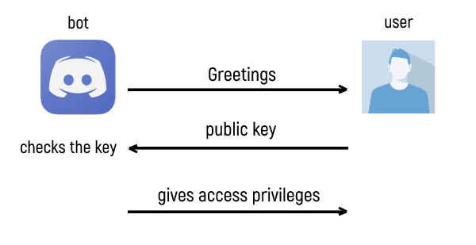

# discord-inviter

A bot that allows you to authorize users in a discord server using their Utopia public keys.
To integrate work between Utopia and Discord accounts



## Installing

```bash
npm install discord.js
```

run bot

```bash
node bot
```

or

```bash
npm start
```

## Instructions

The bot grants access to the server by assigning a specific role to the user. You first need to create this role.

To do this, you need to enable developer mode in Discord. This is done as follows:
Go to User `Settings --> Appearance --> Developer Mode --> ON`
Then go to Server `Settings --> Roles --> Click` on the role you want and Copy ID or put \ symbol before role reference and send this message to chat - the number in it (role reference design <&role.id>) is role ID.

Next, you need to get the Discord API token and specify it in `bot.js`.
